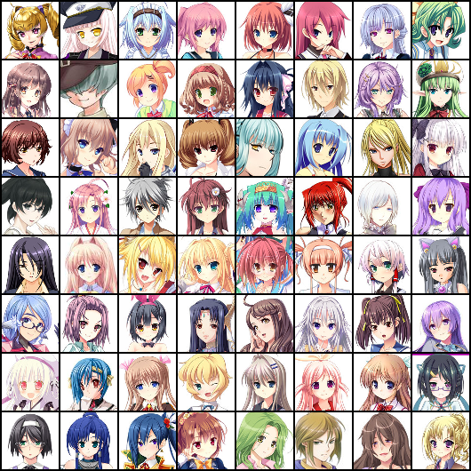

# Anime-Face-Dataset
The datasets can be found here: 
1. **Version 1**, 21551 images, more outliers: https://drive.google.com/file/d/1jdJXkQIWVGOeb0XJIXE3YuZQeiEPd8rM/view?usp=sharing.
2. **Version 2**, 20921 images, higher quality: https://drive.google.com/file/d/1qXTXNhYlucegbBKWZ77vMFlPTR83Wft7/view?usp=sharing

## Disclaimer
This dataset should only be used for educational purposes.
## Author 
Mckinsey666
## Dataset Description
This is an dataset consisting of 20000+ anime faces scraped from www.getchu.com, which are then cropped using the anime face detection algorithm in https://github.com/nagadomi/lbpcascade_animeface. Images in version 1 are resized to 64 * 64 for the sake of convenience, while as images in version 2 vary from 90 * 90 ~ 120 * 120 (you can simply rescale them before using them).

Some outliers are still present in the dataset (mostly in **Version 1**):
- Bad cropping results
- Some non-human faces.

Feel free to contribute to this dataset by adding images of similar quality or adding image labels. 
## Source Code
I made the web-scraping and face-detection code open-source. Make modifications as you wish. To scrape the pictures directly from the website and detect the faces, type the following commands:
```
git clone https://github.com/Mckinsey666/Anime-Face-Dataset.git
cd Anime-Face-Dataset/src
python3 scrape.py
python3 detect.py
```
## Samples 

